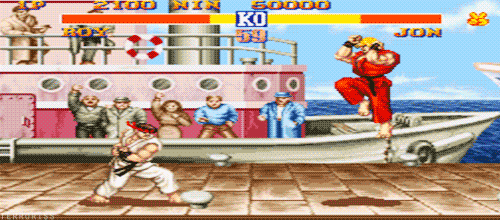

---
layout: post
title: Imagined Code

date: 6 Sep 2016
school: nyu
class: game design
semester: fall
year: 2016
--- 

**Due** 13 Feb 2016

1. Play a game of your choosing
2. Pick an interesting moment
3. Imagine what the code for that moment might be
4. Be prepared to talk about it in class next week