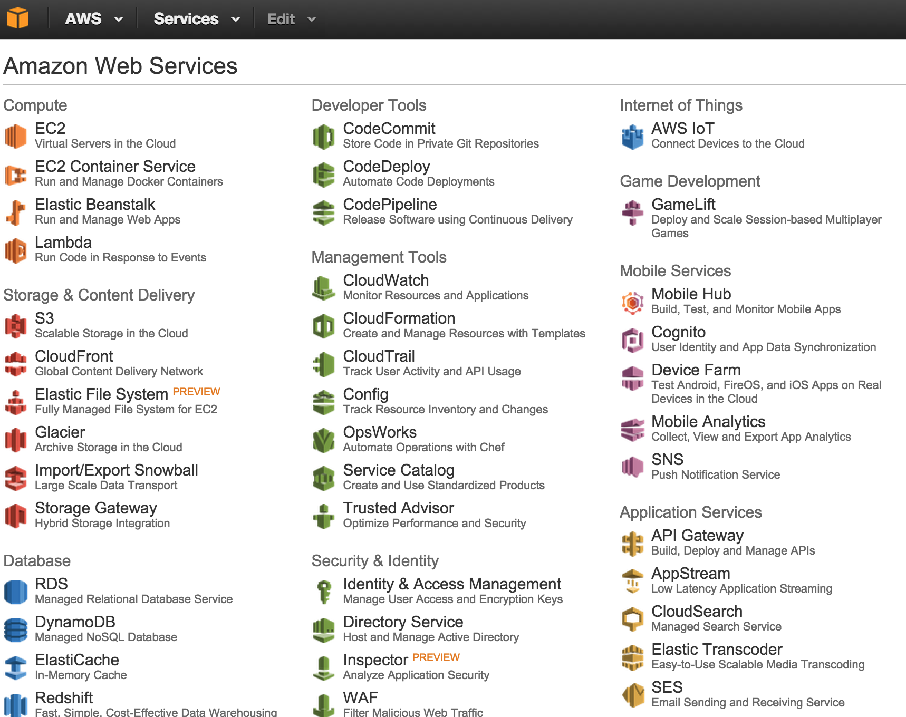

---
layout: post
title: AWS

date: 29 Mar 2016
school: parsons
class: large systems
semester: spring
year: 2016
---   

**Due** 5 Apr 2016

### A Better Pong Specification

Based on your experience with the midterm, design a better specification for a networked Pong game. What would the topology be? Client/server or peer-to-peer? What information is exchanged? How is the information transfered? Is it still OSC, or is there a better way?

### Amazon Web Services

Sign up for an [Amazon Web Services (AWS) account](https://aws.amazon.com/). It is free, and it is the platform we will be using together for the rest of the semester. Make sure you can see the console before you get to class, and we will work together to set up the particular services we need.

