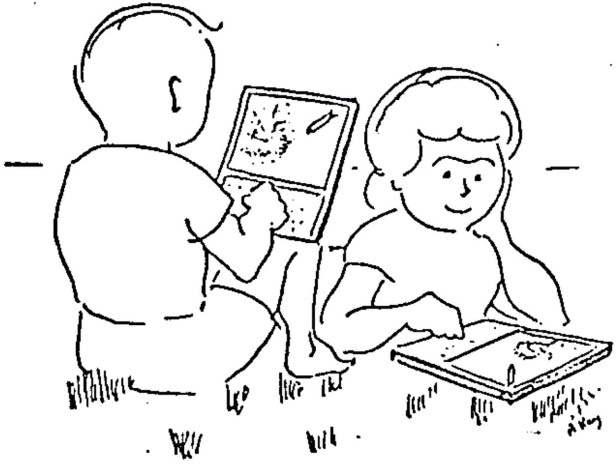

## Boards

*Dec 2 2016* [Hosts](https://cdn.rawgit.com/nasser/aa17a9fb3189866b9deee5324e692074/raw/hosts.svg)  
*Nov 25 2016* [Summary](https://cdn.rawgit.com/nasser/16dad6654838d33b3a7766557cc84268/raw/summary.svg)  
*Nov 18 2016* [REPLs](https://cdn.rawgit.com/nasser/4679208e32e4cdc2deca8996252bb5b1/raw/repls.svg)  
*Nov 11 2016* [Starting Parsing](https://cdn.rawgit.com/nasser/a32706e636f63b7660d65e71efecdaff/raw/starting-parsing.svg)  
*Nov 4 2016* [Computers](https://cdn.rawgit.com/nasser/ffb492170644f4e862e8cdf283e9f323/raw/computers.svg)  
*Oct 28 2016* [Theory of Computation](https://cdn.rawgit.com/nasser/632f5d49959e741dbf286009326fb31b/raw/theory-of-computation.svg)  
*Oct 21 2016* [First Class](https://cdn.rawgit.com/nasser/303f0cb87d6f5a24bc2a60ac10155e94/raw/first-class.svg)  

## Readings and Videos

[Leanable Programming](http://worrydream.com/LearnableProgramming/)  
[A Personal Computer for Children of All Ages](https://www.google.com/url?sa=t&rct=j&q=&esrc=s&source=web&cd=3&ved=0ahUKEwjIvoSMuubQAhXNdSYKHbIWCjMQFgjCATAC&url=http%3A%2F%2Fhistory-computer.com%2FLibrary%2FKay72.pdf&usg=AFQjCNFcCss6lXTJA3bQocEmxTCoW070IA)  
[Simple Made Easy](https://www.infoq.com/presentations/Simple-Made-Easy)  
[Sketch-n-Sketch](https://www.youtube.com/watch?v=YuGVC8VqXz0)  
[Tulip](https://www.youtube.com/watch?v=lvclTCDeIsY)  
[Languages for 3D Industrial Knitting](https://www.youtube.com/watch?v=02h74L1PmaU)  
[Ceptre](https://www.youtube.com/watch?v=bFeJZRdhKcI)  
[Eve](https://www.youtube.com/watch?v=5V1ynVyud4M)  
[Pixie](https://www.youtube.com/watch?v=1AjhFZVfB9c)  
[Gamma](https://www.youtube.com/watch?v=szhvff6GpjM)  
[A History of Programming Languages for 2 Voices](https://www.youtube.com/watch?v=J3C79CDqeW4)  
[Writing a game in Haskell](https://www.youtube.com/watch?v=1MNTerD8IuI)  
[You can be a kernel hacker](https://www.youtube.com/watch?v=0IQlpFWTFbM)  

## Languages

[mal](https://github.com/kanaka/mal)  
[lis.py](http://norvig.com/lispy.html)  
[lis.py2](http://norvig.com/lispy2.html)  
[miniMAL](https://www.npmjs.com/package/minimal-lisp)  
[sbn](https://kosamari.github.io/sbn/)  
[Logo](http://www.calormen.com/jslogo/)  
[Brainfuck](https://copy.sh/brainfuck/)  
[C#](http://tryroslyn.azurewebsites.net/)  
[Ohm Parser](https://ohmlang.github.io/editor/)  