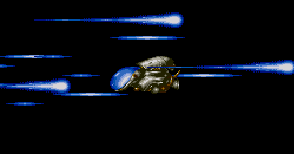

## Resources

[Syllabus](syllabus.pdf) &bull; [Games](games) &bull; [Unity Cheat Sheet](http://nas.sr/teaching/2016/game-design/unity-cheat-sheet/)

## Classes

*31 Oct 2017* [Code](week-9/PhysicsBumper.zip) &bull;
              [Board](https://rawgit.com/nasser/0810a7a68c1532279e73e64995e6f0d1/raw/physics.svg) &bull;
              [Homework](week-9/homework)  
*24 Oct 2017* [Code](week-8/ArtAndMotion.zip) &bull;
              [Board](https://cdn.rawgit.com/nasser/2d13030baa30081faae895e9a4ffea91/raw/linear.svg) &bull;
              [Homework](week-8/homework)  
*17 Oct 2017* [Code](https://gist.github.com/nasser/ddb12b180e029fb5fe03b67c597d2450) &bull;
              [Board](https://cdn.rawgit.com/nasser/609d5567698ac1bc73adb3502131e421/raw/unity-api.svg) &bull;
              [Homework](week-7/homework)  
*10 Oct 2017* [Code](https://gist.github.com/nasser/de81bcd7910d732fb43e2a3c9c984987) &bull;
             [Homework](week-6/homework)  
*3 Oct 2017* [Board](https://cdn.rawgit.com/nasser/697aa600c417743fb8580a6bedbf8002/raw/abstract-games.svg) &bull;
             [Homework](week-5/homework)  
*26 Sep 2017* [Board](https://cdn.rawgit.com/nasser/a0898700397d53abaae2d079ae7a3acd/raw/production.svg) &bull;
              [Homework](week-4/homework)  
*19 Sep 2017* [Board](https://cdn.rawgit.com/nasser/938b08d05db6a1dc70054f63be75bc75/raw/mindmap.svg) &bull;
              [Homework](week-3/homework)  
*12 Sep 2017* [HTML Slides](week-2/slides) &bull;
              [PDF Slides](week-2/slides.pdf) &bull;
              [Homework](week-2/homework)  
*5 Sep 2017* [Board](https://cdn.rawgit.com/nasser/079fca31b5a2553353c66db2e76e944c/raw/games-intro.svg) &bull;
             [Homework](week-1/homework)  
